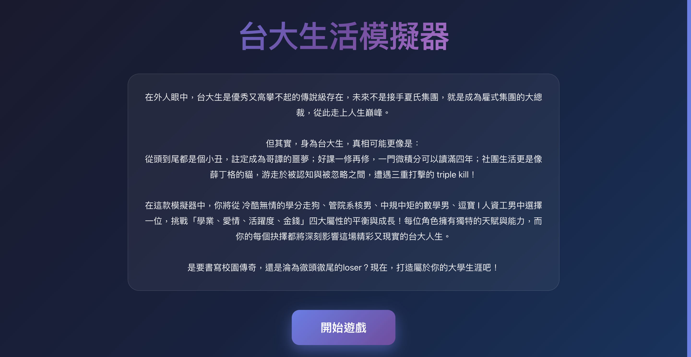
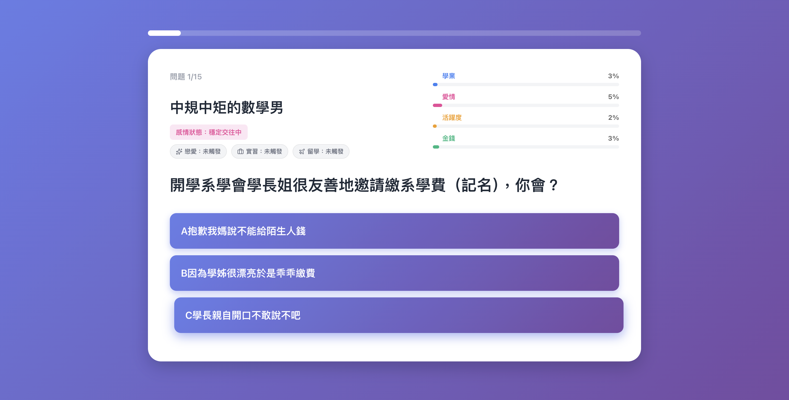

# NTU Life Simulator (Web Version)

### Project Overview
This project is a web-based role-playing game (RPG) designed to simulate campus life at National Taiwan University. It is a graphical interface adaptation of a final group project originally developed for the Programming Design course at the Department of Information Management.

The application transforms the original text-based game logic into a modern Single Page Application (SPA) using React, featuring a responsive design, dynamic state management, and a decoupled data architecture.

<table width="100%">
  <tr>
    <td width="33%" align="center" valign="top">
      <h3>1. Start Screen</h3>
      
    </td>
    <td width="33%" align="center" valign="top">
      <h3>2. Character Selection</h3>
      
    </td>
    <td width="33%" align="center" valign="top">
      <h3>3. Interactive Gameplay</h3>
      
    </td>
  </tr>
</table>

<div align="center">
  <h3>4. Ending & Analysis</h3>
  
</div>

### Technical Architecture
The project utilizes a component-based architecture to ensure scalability and maintainability:

*   **Frontend**: Built with **React 18** and **Vite** for optimized performance.
*   **State Management**: Implements complex game logic (including academic, romance, and financial parameters) using React Hooks.
*   **Data Driven**: Game content—including character statistics, question banks, and ending scenarios—is decoupled from the application logic and served via JSON, allowing for independent content updates.
*   **Responsive Design**: The interface is fully optimized for both desktop and mobile environments using CSS Flexbox and Grid layouts.

### Acknowledgments
Special thanks to the **Programming Design Course Project Group** for the original concept and content creation. The narrative scripts, character backstories, and game scenarios utilized in this application are derived from the collaborative efforts of the team.

### Installation and Usage

Prerequisites: Node.js (v16+)

1.  **Clone the repository**
    ```bash
    git clone https://github.com/YourUsername/ntu-life-simulator.git
    cd ntu-life-simulator
    ```

2.  **Install dependencies**
    ```bash
    npm install
    ```

3.  **Start the development server**
    ```bash
    npm run dev
    ```

### License
This project is licensed under the MIT License.